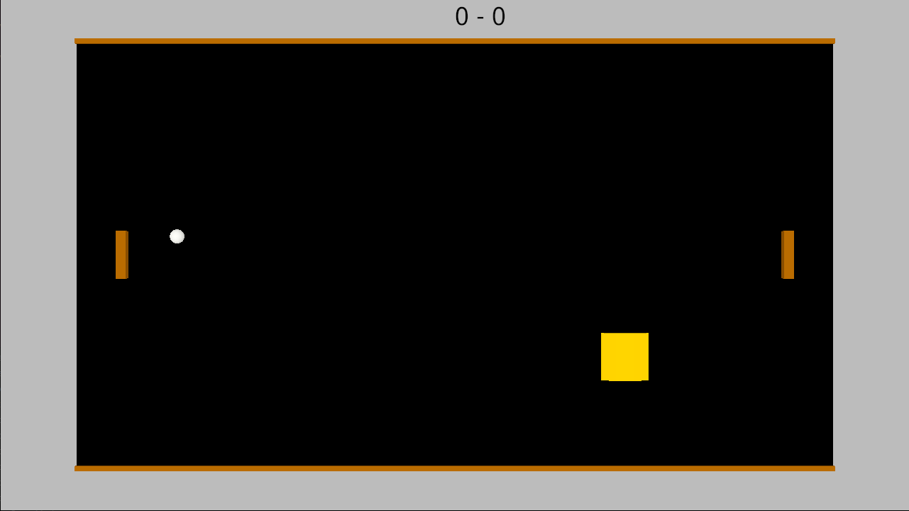

# (TODO: your game's title)

Author: Better Pong

Design: This game offers a fin twist on pong with multiple different power ups that change the way the game is played

Networking: The server calculates the positions of all the objects on screen and they are drawn by each player individually. This code is in Game.*pp, PlayMode.*pp, client.cpp and server.cpp.

Screen Shot:

How To Play:

Each player can move their paddle with the up and down arrow keys as well and w and s. The goal is to bounce the ball to the opponent's wall while protecting your own to score points.

Sources: Song: Ping Pong - Classic Arcade Game by Dream-Protocol on [Pixabay](https://pixabay.com/music/video-games-ping-pong-classic-arcade-game-116818/).

This game was built with [NEST](NEST.md).

